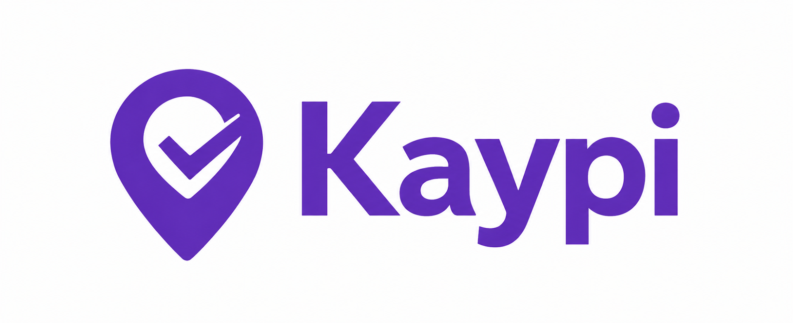

<p align="center">
  
</p>

# Kaypi · Asistencia verificada

Check-in de asistencia **multicanal** (web · móvil · kiosco) con **niveles de confianza
configurables** y **presencia confirmada**. Cada canal produce un único **evento canónico** del
que viven el dashboard, el cálculo de horas, la pre-nómina y los reportes (PDF/CSV).

> *Kaypi* = quechua **"aquí / en este lugar"**. El producto confirma presencia: estás aquí, quedó registrado.

## Stack
- **apps/web** — Next.js 16 (App Router): admin · check-in web · kiosco (lector QR + emisor demo) · API de marcaje · dashboard · pre-nómina · export PDF/CSV. Tailwind v4 + componentes shadcn-style. Auth real (JWT en cookie HTTP-only, bcrypt, guards por rol).
- **apps/mobile** — Expo / React Native (SDK 54) + NativeWind: modos **Employee** (biometría del dispositivo) y **Shared site** (GPS + foto + beacon BT mock + código admin). Cola offline en `AsyncStorage`. Pruebas E2E con Maestro.
- **packages/shared** — el contrato: evento canónico (zod), enums, geofence (Haversine), motor T&A, helpers de QR con HMAC para el kiosco.
- **packages/db** — Drizzle ORM + libSQL/Turso (SQLite distribuido; *embedded replica* para el kiosco offline). 11 tablas, seed reproducible.
- **packages/ui** — design system **"Presencia serena"**: tokens oklch, componentes y animaciones (ver [DESIGN.md](DESIGN.md)).

El facial es el reconocimiento **nativo del dispositivo** como factor ligero de presencia (solo la **foto del marcaje** como evidencia; sin plantillas en servidor ni liveness). **Trust Score**, WhatsApp, agente IA, liveness y biometría real son **follow-up** (visión), **no** V1.

## Equipo (workstreams)
| Quién | Workstream | Carpetas |
|---|---|---|
| **Andrés** | Plataforma, auth, admin (CRUD), dashboard/reportes, pre-nómina, exports, contrato/API | `packages/*`, `app/(admin)`, `app/(reportes)`, `app/api`, `app/(auth)` |
| **Julián** | Kiosco QR (lector con cámara + emisor demo en el móvil) | `app/(kiosco)`, `packages/shared/src/kiosco-qr.ts` |
| **Felipe** | Móvil (Expo): facial nativo, GPS, foto, beacon BT mock, cola offline | `apps/mobile` |

## Estructura
```
packages/shared   contrato (evento canónico · zod · geofence · T&A · QR HMAC)
packages/db       schema Drizzle (11 tablas) + cliente libSQL + seed
packages/ui       design system (tokens · componentes · animaciones)
apps/web          Next.js 16 — admin · check-in · kiosco · reportes · nómina · /api/*
apps/mobile       Expo SDK 54 — Employee (facial) y Shared site (geo+foto+BT mock)
docs/             PRDs (Check-In, Kiosco-QR) y handoff del día 0
```

## Comandos
```bash
npm install                 # instala todos los workspaces
npm run db:push             # crea/actualiza el schema en la DB local (kaypi.db en la raíz)
npm run db:seed             # carga datos de demostración (1 empresa, 2 oficinas, 5 empleados, 2 kioscos, marcajes de varios días)
npm run db:studio           # inspecciona la DB (Drizzle Studio)
npm run dev:web             # Next.js → http://localhost:3000 (incluye /diseno, vitrina del DS)
npm run dev:mobile          # Expo (requiere simulador / Expo Go)
npm test                    # tests del contrato + nómina (vitest)
npm run typecheck           # typecheck de todos los workspaces
```

En desarrollo se usa un archivo SQLite local (`kaypi.db`), **sin credenciales**. Para Turso, define `DATABASE_URL` y `DATABASE_AUTH_TOKEN` (ver [`.env.example`](.env.example)). El kiosco lee `KIOSCO_ID` para identificar su fila en la tabla `kiosco`.

### Login demo
El seed crea 5 empleados con contraseña `demo1234`. Algunas cuentas útiles:

| Email | Rol | Oficina |
|---|---|---|
| `andres@kaypi.demo` | ADMIN | CDMX |
| `julian@kaypi.demo` | MANAGER | CDMX |
| `felipe@kaypi.demo` | EMPLEADO | CDMX |
| `lucia@kaypi.demo` | EMPLEADO | Lima |

ADMIN y MANAGER entran a `/admin`; EMPLEADO va al home.

## El contrato
El **evento canónico** vive en `packages/shared`. El servidor **sella el timestamp en UTC** — nunca se confía en el reloj del cliente. Flujo común a los 3 canales:

```
canal → POST /api/checkin → valida política · sella servidorUTC · calcula geofence/flags → persiste → dashboard/reportes/nómina
```

El canal **KIOSCO** añade una validación específica: el celular del empleado emite un QR rotativo firmado con HMAC-SHA256 sobre su `qrSecret`, y el kiosco lo verifica con anti-replay (60 s), ventana de validez (±60 s) y match de oficina. Detalles en [docs/PRD-Kiosco-QR.md](docs/PRD-Kiosco-QR.md).

## Rutas de `apps/web`

### Públicas
- `/login` — login con email + password (bcrypt). Redirige a `/admin` o `/` según rol.

### Admin (solo ADMIN/MANAGER)
- `/admin` — dashboard de conteos.
- `/admin/oficinas`, `/admin/jornadas`, `/admin/politicas`, `/admin/empleados`, `/admin/kioscos` — CRUDs completos.
- `/admin/empleados/[id]` — **detalle de marcajes** del empleado agrupados por día con subtotal de horas.
- `/admin/marcajes` — vista cronológica de todos los canales con filtros.
- `/admin/reportes` — T&A agregado (faltas, retrasos, horas extra) en vista lista o calendario semanal.
- `/admin/nomina`, `/admin/nomina/[empleadoId]` — pre-nómina con compensaciones.
- `/admin/revisiones` — flujo de aprobación/auditoría de ajustes.

### Captura
- `/checkin` — placeholder del check-in web (Día 0).
- `/kiosco/lector` — cámara continua (`@zxing/browser`) que escanea el QR del empleado.
- `/kiosco/qr` — emisor demo del QR rotativo (usa `/api/dev/empleado/[id]/secret`).

### API
- `POST /api/checkin` — endpoint canónico para los 3 canales.
- `GET  /api/checkin` — lista de eventos (filtros por empleado/oficina).
- `GET  /api/export/reportes?formato=csv|pdf&...` — exporta el reporte T&A.
- `GET  /api/export/nomina?formato=csv|pdf&...` — exporta la pre-nómina.
- `GET  /api/dev/empleado/[id]/secret` — devuelve el `qrSecret` del empleado (solo `NODE_ENV !== 'production'`, usado por la demo del kiosco).

## Documentación
- **PRD principal** (alcance, modelo de datos, reglas): [docs/PRD-Check-In.md](docs/PRD-Check-In.md)
- **PRD Kiosco QR**: [docs/PRD-Kiosco-QR.md](docs/PRD-Kiosco-QR.md)
- **Estado / handoff del día 0**: [docs/ESTADO-DIA-0.md](docs/ESTADO-DIA-0.md)
- **Línea de diseño**: [DESIGN.md](DESIGN.md)
- **Móvil (modos, Maestro, checks)**: [apps/mobile/README.md](apps/mobile/README.md)
