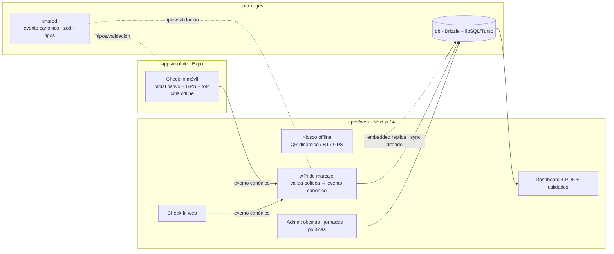

# PRD — Kaypi · Check-In / Asistencia Verificada (V1 · Hackathon)

| | |
|---|---|
| **Estado** | Borrador v1 — listo para arrancar build |
| **Repo** | `kaypi` (monorepo: `apps/web`, `apps/mobile`, `packages/db`, `packages/shared`) |
| **Equipo** | 3 personas, divididas por workstream (ver §11) |
| **Fuente de verdad** | `CHECK - IN especificaciones.md` (lo que el equipo acordó) |
| **Contexto de apoyo** | `Check-in solution.md` + propuestas "Asistencia Verificada" (dominio T&A, fraude, compliance) |
| **Regla de alcance** | Lo que está en la spec = **V1**. Lo que solo aparece en las propuestas = **follow-up** (§12) |

---

## 0. TL;DR

Construir un sistema de **check-in de asistencia** para que un empleado marque entrada/salida por **web, móvil o kiosco**, con **niveles de confianza configurables** (login → login+geo → login+facial nativo), que produzca un **evento de marcaje estandarizado** y lo muestre en un **dashboard** (lista + calendario) con faltas, retrasos y horas extra, más un **reporte PDF mensual**. Incluye **kiosco offline** (réplica local que sincroniza) y un **fallback con código rotativo** + **check-in manual** cuando el checador falla.

El corazón del diseño es **un único evento canónico de check-in** (§7), que vive en `packages/shared`: el contrato que todos los canales producen y del que viven el dashboard, el cálculo de horas y los reportes. Si los tres workstreams congelan ese contrato el día 0, trabajan en paralelo sin bloquearse.

---

## 1. Contexto y objetivo

**Qué es un check-in (T&A).** El dominio separa dos capas: **(1) captura** (identidad, ubicación, hora sellada, anti-fraude) y **(2) motor de interpretación** (empata jornada, calcula horas extra, faltas, retrasos). Este V1 cubre **la captura + un motor de interpretación mínimo + reportes**.

**Objetivo del V1.** Un flujo demostrable de punta a punta: el empleado marca → el sistema valida según la política → guarda un evento canónico → el admin lo ve en el dashboard con métricas y puede descargar el PDF. Demostrable en los 3 canales, con énfasis en **móvil (facial nativo)** y **kiosco offline**.

**Restricción dura.** Es un hackathon: priorizamos un **slice vertical funcional y creíble** sobre completitud. Lo complejo (sync robusto) se acota o se simula de forma explícita (§10, §11).

---

## 2. Alcance

### 2.1 Dentro del V1 (en la spec)

- **Configuración (Admin):** crear **oficinas** (cada una con su config; el empleado se asigna a una), configurar **jornadas** (máx. horas semanales/diarias, fija o flexible, entrada/salida, comida/descanso, timezone de trabajo), configurar **política de check-in** (canales + niveles + fallback).
- **Captura / Check-in:** canales **web / móvil / kiosco**; niveles **solo login**, **login + geo**, **login + facial nativo**; **foto por marcaje**; **fallback con código rotativo**.
- **Reportes / Dashboard:** filtros (oficina / fecha / empleado), **modo lista** (nombre · oficina · faltas · retrasos · horas extra), **modo calendario**, **PDF mensual** resumen por empleado.
- **Utilidades:** validar el código del checador cuando falla y crear un **check-in manual**.
- **Arquitectura (scaffold real, §3):** `apps/web` (Next.js 14: admin + check-in web + kiosco + API) · `apps/mobile` (Expo: facial nativo + GPS + offline) · `packages/db` (Drizzle + libSQL/Turso) · `packages/shared` (tipos + validaciones + evento canónico).

### 2.2 Fuera del V1 (→ follow-up, §12)

Biometría real (plantillas en servidor, consentimiento/retención/borrado), **liveness/anti-spoof**, niveles **"mismo wifi"** y **"mismo dispositivo"** (en la spec "solo mención"), WhatsApp + agente IA, **Trust Score** con IA, copiloto de excepciones, **mock-GPS/VPN detection**, device binding, **REP-P/AFD (Brasil)**, multi-idioma PT.

> **Nota sobre facial (decisión del equipo):** usamos el **reconocimiento facial nativo del dispositivo** (Expo) como factor de identidad/presencia ligero al marcar. **No** construimos un sistema biométrico: no almacenamos plantillas faciales en el servidor (solo la **foto del marcaje** como evidencia), no hay flujo de consentimiento/borrado ni liveness. Limitación documentada: sin liveness, el facial es un factor débil contra suplantación con foto → se endurece en follow-up. *(El README de `kaypi` aún dice "biometría" y "Trust Score" — alinear ese wording con este alcance V1; ver §13.)*

---

## 3. Arquitectura



**Decisiones de arquitectura (alineadas al scaffold de `kaypi`):**

- **`apps/web` (Next.js 14, App Router):** hospeda **admin + check-in web + kiosco + API** (route handlers como API de marcaje). Separar por feature dentro de `app/` para que los 3 owners no se pisen, p. ej. `app/(admin)`, `app/(checkin)`, `app/(kiosco)`, `app/(reportes)`, `app/api/checkin`.
- **`apps/mobile` (Expo / React Native):** canal principal del nivel facial — reconocimiento **facial nativo** + GPS + foto + **cola offline**.
- **`packages/db` (Drizzle + libSQL/Turso):** una sola fuente de schema. **Turso/libSQL es SQLite distribuido** → quita la limitación de single-writer del SQLite clásico, y su **embedded replica** es exactamente la "réplica del servidor" que pide la spec para el kiosco (SQLite local que sincroniza con la DB central).
- **`packages/shared`:** tipos + validaciones (zod) + el **evento canónico (§7)**. Es el contrato que importan `apps/web` y `apps/mobile`. **Se congela el día 0.**
- **Timestamp canónico = el del servidor en UTC.** El reloj del dispositivo **no** se confía. El cliente manda su hora local solo como referencia; el servidor sella `tsServidorUTC` al recibir. En el kiosco offline se sella con hora local + `fuente: KIOSCO_OFFLINE` y el servidor concilia al sincronizar (§8).

---

## 4. Modelo de datos (`packages/db` · Drizzle)

Entidades mínimas del V1 (tablas Drizzle sobre libSQL/Turso):

| Entidad | Campos clave | Notas |
|---|---|---|
| **Empresa** | `id`, `nombre` | Single-tenant para el demo; agrupa oficinas |
| **Oficina** | `id`, `empresaId`, `nombre`, `direccion`, `lat`, `lng`, `geofenceRadiusM`, `timezone` | **Contiene la config**; el empleado se asigna a una |
| **Jornada** | `id`, `oficinaId`, `nombre`, `tipo` (`FIJA`\|`FLEXIBLE`), `maxHorasDiarias`, `maxHorasSemanales`, `horaEntrada`, `horaSalida`, `descansoInicio`, `descansoFin`/`descansoMin`, `timezone?` | Si `FLEXIBLE`, entrada/salida null; excedente sobre máximos = hora extra |
| **PoliticaCheckIn** | `id`, `oficinaId`, `canales` (`["WEB","MOVIL","KIOSCO"]`), `nivel` (`SOLO_LOGIN`\|`LOGIN_GEO`\|`LOGIN_FACIAL`), `enforcement` (`BLOCK`\|`FLAG`), `fallbackHabilitado` | Vive en la oficina; ver matriz §6.2 |
| **Empleado** | `id`, `empresaId`, `oficinaId`, `jornadaId`, `nombre`, `email`, `passwordHash`, `rol` (`ADMIN`\|`MANAGER`\|`EMPLEADO`), `fotoRefPerfil?` | Foto de perfil opcional como referencia visual (no plantilla biométrica) |
| **CheckInEvent** | `id`, `empleadoId`, `oficinaId`, `tipo` (`IN`\|`OUT`\|`BREAK_START`\|`BREAK_END`), `tsServidorUTC`, `tz`, `canal`, `lat`, `lng`, `accuracyM`, `geofenceOk`, `facialOk`, `fotoRef`, `nivelAplicado`, `flags` (json), `fuente` (`NORMAL`\|`MANUAL`\|`FALLBACK_CODE`\|`KIOSCO_OFFLINE`), `creadoPor?` | El "punch". `flags` lista anomalías |
| **CodigoFallback** | `id`, `oficinaId`, `codigo`, `generadoEn`, `validoHasta`, `usadoPor?`, `usadoEn?` | Código rotativo = `código + hora + día`; ventana corta (ej. 5 min) |
| **AuditLog** | `id`, `entidad`, `entidadId`, `accion`, `actorId`, `ts`, `detalle` (json) | **Append-only**; toda corrección/manual/override se registra, nunca se sobreescribe |

**Resultados T&A (faltas/retrasos/horas extra)** se **calculan al leer** (no se materializan en V1): se derivan de los `CheckInEvent` vs la `Jornada` del empleado para el rango consultado (§6.3).

---

## 5. Funcionalidades

### 5.1 Configuración (Admin) — `app/(admin)`

- **Oficinas:** CRUD. Ubicación (lat/lng + radio de geofence), timezone, contenedor de config. El empleado pertenece a **una** oficina.
- **Jornadas:** CRUD por oficina. Fija (entrada/salida + descanso) o flexible (solo máximos). Define máximos diarios/semanales que disparan hora extra y el bloque de comida.
- **Política de check-in:** por oficina: canales habilitados + nivel requerido + enforcement (§6.2) + fallback on/off.
- **Empleados:** alta/edición, asignación a oficina y jornada, rol.

### 5.2 Captura / Check-in (empleado)

Flujo común a los 3 canales (mismo evento canónico de salida):

1. **Login** (usuario/contraseña).
2. **Identidad según nivel** de la política de su oficina:
   - `SOLO_LOGIN`: nada más.
   - `LOGIN_GEO`: GPS → valida geofence.
   - `LOGIN_FACIAL`: **móvil** dispara el **reconocimiento facial nativo** (Expo) + **foto** del marcaje.
3. **Tipo de marcaje:** IN / OUT / BREAK_START / BREAK_END (botón directo, UX ≤5s).
4. **Resultado:** confirmación visual inmediata (estado + hora + nombre). Si un factor falla → según `enforcement`: bloquea o marca con `flag`.
5. **Fallback:** si el checador/canal falla → **código rotativo** (§5.4).

| Canal | Carpeta | Identidad | Ubicación |
|---|---|---|---|
| **Móvil (Expo)** | `apps/mobile` | Facial nativo + foto | GPS preciso |
| **Web** | `apps/web · app/(checkin)` | Login (+ foto webcam opcional) | Geolocalización del navegador |
| **Kiosco** | `apps/web · app/(kiosco)` | Login / **QR dinámico** / proximidad **bluetooth** | Fija (ubicación del kiosco) |

### 5.3 Reportes / Dashboard — `app/(reportes)`

- **Filtros:** oficina, fecha (rango), empleado, búsqueda por ID/nombre/email.
- **Modo lista:** `nombre · oficina · faltas · retrasos · horas extra` (por rango).
- **Modo calendario:** vista semanal empleados × días (cada celda: estado del día — marcajes, retraso, falta, extra).
- **PDF mensual:** resumen por empleado tipo calendario. *Formato a confirmar con Néstor (§13).*

### 5.4 Utilidades — código fallback + check-in manual

- **Generación:** kiosco/servidor genera un **código rotativo** (`código + hora + día`), válido por una ventana corta (ej. 5 min), mostrado en pantalla.
- **Validación + check-in manual:** sección admin para **validar un código** que el empleado reporta y, si es válido, **registrar el marcaje manualmente**.
- **Corrección/override:** el marcaje manual **no** sobreescribe; crea un evento `fuente=MANUAL` + `creadoPor`, con razón obligatoria, y entra al **AuditLog**.

---

## 6. Reglas de validación (lo que la spec no detalla — propuesta)

### 6.1 Geofence

`geofenceOk = distancia(marcaje, oficina) ≤ oficina.geofenceRadiusM` (Haversine). Radio configurable por oficina (default 150 m).

### 6.2 Matriz de enforcement (decisión clave a confirmar)

Qué pasa cuando un factor del nivel **falla**:

| Nivel | Factor que falla | `BLOCK` | `FLAG` |
|---|---|---|---|
| LOGIN_GEO | Fuera de geofence | Rechaza | Acepta + `flag: "fuera_geofence"` |
| LOGIN_FACIAL | Facial no pasa | Rechaza | Acepta + `flag: "facial_fallo"` |
| Cualquiera | Sin red (móvil) | Encola y reintenta | Encola y reintenta |

> **Recomendación:** default **FLAG** en V1 (nunca descartar un marcaje en silencio; el manager revisa los `flags`). Descartar sin auditoría es riesgo legal.

### 6.3 Cálculo T&A (motor mínimo)

- **Retraso:** primer `IN` del día > `horaEntrada` + tolerancia (default 0–5 min). Solo jornada `FIJA`.
- **Falta:** no hay `IN` en día laborable. *(V1: sin integración a permisos; "sin IN" = falta. Permisos = follow-up.)*
- **Horas extra:** `horas del día > maxHorasDiarias` **o** `horas de la semana > maxHorasSemanales`. Horas = pares IN/OUT menos descansos.
- **Timezone:** se almacena en UTC; se presenta en el `timezone` de la oficina/jornada.

---

## 7. Evento canónico de check-in (`packages/shared` · el contrato)

Todos los canales producen **este mismo objeto** (zod schema + tipos TS exportados desde `packages/shared`). Se congela el día 0.

```json
{
  "eventId": "uuid",
  "empleadoId": "emp_123",
  "oficinaId": "ofi_1",
  "tipo": "IN | OUT | BREAK_START | BREAK_END",
  "timestamp": { "servidorUTC": "2026-06-12T14:03:00Z", "tz": "America/Mexico_City", "clienteLocal": "2026-06-12T08:03:00-06:00" },
  "canal": "WEB | MOVIL | KIOSCO",
  "nivelAplicado": "SOLO_LOGIN | LOGIN_GEO | LOGIN_FACIAL",
  "ubicacion": { "lat": 19.4326, "lng": -99.1332, "accuracyM": 12, "geofenceOk": true },
  "identidad": { "facialOk": true, "fotoRef": "..." },
  "fuente": "NORMAL | MANUAL | FALLBACK_CODE | KIOSCO_OFFLINE",
  "flags": [],
  "creadoPor": null
}
```

**Flujo:** canal → `POST /api/checkin` (valida política, sella `servidorUTC`, calcula `flags`) → persiste `CheckInEvent` en `packages/db` → disponible para dashboard/PDF.

---

## 8. Offline & sync (kiosco)

- **Réplica local:** el kiosco corre `apps/web` en el PC fijo con una **embedded replica de libSQL/Turso** (SQLite local que sincroniza con la DB central) — esto realiza la "réplica del servidor" de la spec.
- **Cola + sync:** offline, los marcajes se guardan local con `fuente=KIOSCO_OFFLINE` y hora local; al recuperar red, `sync()` empuja al central. El servidor **no** confía en la hora local para la canónica; la guarda como `clienteLocal`.
- **Conflictos:** política = **conservar ambos** y marcar conflicto para revisión (nunca descartar en silencio).
- **QR dinámico / bluetooth:** el kiosco muestra un **QR que rota** que el móvil escanea para confirmar presencia; bluetooth como señal de proximidad. *(V1: simulable si el tiempo aprieta — §11.)*

---

## 9. Seguridad, auth y roles

- **Auth:** login usuario/contraseña (hash), sesión por token.
- **Roles:** `ADMIN` (config + reportes + utilidades), `MANAGER` (reportes de su oficina + correcciones), `EMPLEADO` (solo marcar).
- **Código fallback / QR:** ventana corta + un solo uso (anti-replay).
- **Auditoría:** AuditLog append-only para correcciones y marcajes manuales.

---

## 10. Riesgos y mitigaciones

| Riesgo | Mitigación V1 |
|---|---|
| Sync offline robusto es complejo en 4 días | Apoyarse en **embedded replicas de Turso** (sync nativo); demo con corte de red controlado |
| Facial nativo sin liveness se burla con foto | Documentado; foto auditable + flag; liveness → follow-up |
| `apps/web` compartido por A/B/C → conflictos | Carpetas por feature en `app/`; el contrato (§7) en `packages/shared` desacopla |
| Dependencia del PDF (Néstor) | Definir formato mínimo nosotros; cerrar con Néstor antes de Mié |
| WS bloqueados por el backend | **Contrato (§7) congelado día 0**; B y C mockean la API hasta que A esté viva |

---

## 11. Plan de trabajo — división para 3 personas

Cada quien es **dueño de un workstream**. El acuerdo del día 0: **evento canónico (§7) en `packages/shared` + schema en `packages/db` + endpoints de la API**.

| WS | Dueño | Alcance | Carpetas |
|---|---|---|---|
| **A · Plataforma & Admin** | Persona 1 | Schema (Drizzle), **evento canónico + validaciones (zod)**, auth + roles, CRUD de Oficinas/Jornadas/Políticas/Empleados, **API de marcaje** (`/api/checkin` con enforcement + flags), generación/validación del código fallback, motor T&A mínimo (§6.3) | `packages/db`, `packages/shared`, `apps/web/app/(admin)`, `apps/web/app/api` |
| **B · Captura (móvil + web)** | Persona 2 | Cliente **móvil Expo** (facial nativo + GPS + foto + cola offline + código fallback) y **check-in web**; matriz de niveles (§6.2) contra la API de A; UX ≤5s + confirmación visual | `apps/mobile`, `apps/web/app/(checkin)` |
| **C · Kiosco offline + Reportes** | Persona 3 | **Kiosco** (embedded replica + cola/sync + QR dinámico/bluetooth) y **Dashboard** (lista + calendario + filtros) + **PDF mensual** + **Utilidades** (validar código + check-in manual/corrección) | `apps/web/app/(kiosco)`, `apps/web/app/(reportes)` |

**Dependencias:** B y C dependen del schema + API de A. **Mitigación:** A publica el contrato (`packages/shared`) y un mock/stub el día 0; B y C trabajan contra el mock y conmutan a la API real cuando esté.

**Qué construir vs simular (realismo de hackathon):**

| 🔨 Construir | 🎭 Simular si falta tiempo |
|---|---|
| Flujo IN/OUT real en móvil con facial nativo + GPS + foto | Sync offline → demo con corte de red controlado o "modo offline" |
| API de marcaje + evento canónico + dashboard lista/calendario | QR dinámico/bluetooth → QR estático o mock de proximidad |
| Código fallback + check-in manual | PDF → plantilla simple si no se cierra con Néstor |

---

## 12. Follow-up (no entra al V1 — siguiente implementación)

De las propuestas "Asistencia Verificada": **WhatsApp + agente IA**, **Trust Score** (scoring anti-fraude con IA), **copiloto de excepciones**, **liveness/anti-spoof** (Truora/Incode), **biometría real** (plantillas + consentimiento + retención/borrado), **mock-GPS/VPN detection**, **device binding**, niveles **"mismo wifi" / "mismo dispositivo"**, **REP-P/AFD (Brasil)**, integración a **nómina/turnos/permisos**, **multi-idioma PT**, formalización del trabajador informal.

---

## 13. Decisiones abiertas (cerrar en/antes del día 0)

1. **PDF mensual:** formato y campos exactos → **hablar con Néstor** (en la spec).
2. **Enforcement default:** ¿`BLOCK` o `FLAG` por nivel? (recomendado `FLAG`, §6.2).
3. **Tolerancia de retraso** y si los descansos se marcan (BREAK_START/END) o se descuentan automático.
4. **Geofence:** ¿obligatorio para todas las oficinas o configurable on/off?
5. **Empleado ↔ oficina:** ¿una sola (como dice la spec) o varias? (V1: una).
6. **Kiosco:** QR/bluetooth reales vs simulados según tiempo.
7. **README de `kaypi`:** alinear wording ("biometría" → facial nativo; "Trust Score" → marcar como visión/follow-up, no V1).

---

## Apéndice · Glosario

| Término | Significado |
|---|---|
| **T&A** | Time & Attendance (control de tiempo y asistencia) |
| **Marcaje / punch** | Un evento de check-in (entrada/salida/descanso) |
| **Jornada** | Configuración de horario/horas de un empleado |
| **Oficina** | Sede con su config (ubicación, geofence, timezone, política) |
| **Geofence** | Perímetro virtual alrededor de la oficina |
| **Evento canónico** | El formato único de evento que producen todos los canales (`packages/shared`) |
| **Facial nativo** | Reconocimiento facial del propio dispositivo (Expo), sin plantillas en servidor |
| **Embedded replica** | SQLite local (libSQL/Turso) que sincroniza con la DB central → habilita el kiosco offline |
| **Fallback** | Código rotativo (código+hora+día) para confirmación/marcaje manual |
| **Enforcement** | Si un factor falla: bloquear el marcaje (BLOCK) o aceptarlo marcado (FLAG) |
