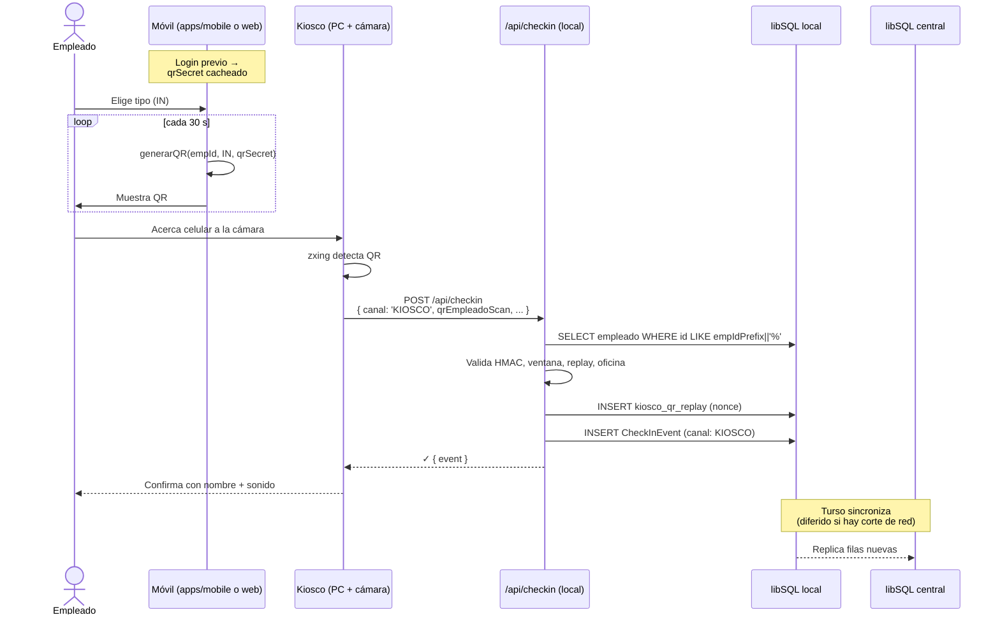

# PRD — Kiosco · QR dinámico (empleado emite, kiosco lee)

| | |
|---|---|
| **Workstream** | Captura / kiosco (Julián) |
| **Estado** | Borrador para implementación |
| **Fecha** | 2026-06-10 |
| **Depende de** | `docs/PRD-Check-In.md` (contrato canónico §7, schema §4), Día 0 cerrado |
| **Alcance** | Generación del QR en el celular del empleado y lectura/validación en el kiosco. Bluetooth fuera. |

> **Nota de dirección.** El PRD-Check-In §8 sugería que "el kiosco muestra un QR que rota y el móvil lo escanea". Lo invertimos: **el celular del empleado genera el QR rotativo y el kiosco lo escanea con su cámara**. Esta dirección encaja con la promesa "kiosco offline" del kaypi: el kiosco persiste en su **embedded replica** de libSQL y sincroniza diferido; el empleado no necesita conectividad para marcar.

---

## 1. Resumen

El empleado abre la app (`apps/mobile` o `app/(checkin)`), elige el tipo de marcaje (IN/OUT/BREAK_START/BREAK_END) y la pantalla muestra un **QR rotativo cada 30 s** firmado con HMAC-SHA256 usando un **secreto por empleado** (`qrSecret`). Acerca el celular a la **cámara del kiosco**. El kiosco escanea, valida localmente contra su roster (sincronizado vía libSQL embedded replica), persiste el `CheckInEvent` en su DB local y deja que Turso replique al central cuando vuelva la red.

---

## 2. Alcance

### Dentro

- Columna `qrSecret` en `empleado` (32 bytes random, base64).
- Tabla `kiosco` (identidad del kiosco y su oficina).
- Tabla `kiosco_qr_replay` local (anti-replay 60 s).
- Helpers en `packages/shared`: `generarQR`, `parsearQR`, `verificarHMAC`.
- Extensión opcional del `CheckInInputSchema` con `qrEmpleadoScan`.
- Branch de validación en `POST /api/checkin` cuando `canal === 'KIOSCO'`.
- Página `app/(kiosco)/kiosco/page.tsx`: cámara con `@zxing/browser`, scan continuo, feedback visual al validar.
- Flags nuevos en el catálogo (`KIOSCO_QR_*`).
- Endpoint dev `POST /api/dev/qr` (helper para que B/Felipe prueben sin implementar aún el cliente).

### Fuera

- Bluetooth.
- Cliente que muestra el QR en el celular (lo cubren B en `app/(checkin)` y Felipe en `apps/mobile` — este PRD solo congela el formato del QR como contrato).
- Onboarding del kiosco con QR de pairing (V1: alta por seed o admin manual).
- Rotación del `qrSecret` por empleado (V1: estático tras crear el empleado).
- PWA / fullscreen / wake lock del kiosco (otro PRD si hace falta).
- Multi-kiosco por oficina con balance (V1: 1:1).

---

## 3. Formato del QR

```
v1.{empId}.{tipo}.{ts}.{nonce}.{hmac}
```

| Campo | Tamaño | Notas |
|---|---|---|
| `v1` | 2 | versión del protocolo |
| `empId` | 8 | primeros 8 chars hex del UUID del empleado |
| `tipo` | 1 | `I` (IN) \| `O` (OUT) \| `S` (BREAK_START) \| `E` (BREAK_END) |
| `ts` | ~9 | epoch ms en base36 |
| `nonce` | 8 | random base64url |
| `hmac` | 22 | HMAC-SHA256 truncado a 16 bytes, base64url sin padding |

**Total:** ~54 chars → QR Versión 4 alfanumérico. Trivial de escanear desde 20-40 cm.

**Mensaje firmado:** `v1.{empId}.{tipo}.{ts}.{nonce}` (UTF-8). El HMAC se calcula con `empleado.qrSecret`.

**Rotación:** cada 30 s. **Ventana de validez:** ±60 s desde `ts` (tolera drift de reloj y scan tardío).

---

## 4. Generación (lado celular del empleado)

> Sub-flujo cubierto por B/Felipe, no por kiosco. Lo describimos aquí para que el contrato del QR quede claro.

Al login, el servidor entrega `qrSecret` junto con el perfil del empleado. La app lo persiste en almacenamiento seguro del dispositivo (Keychain/Keystore en Expo, `IndexedDB` cifrado en web). Una vez cacheado, el celular puede generar QRs **offline indefinidamente**.

```typescript
// packages/shared/src/kiosco-qr.ts
import { createHmac, randomBytes } from 'node:crypto'; // server-side
// versión browser/Expo: usar Web Crypto API

export function generarQR(input: {
  empleadoId: string;
  tipo: 'IN' | 'OUT' | 'BREAK_START' | 'BREAK_END';
  qrSecret: string;
  ts?: number;
}): { qr: string; ts: number; nonce: string } {
  const tipoChar = { IN: 'I', OUT: 'O', BREAK_START: 'S', BREAK_END: 'E' }[input.tipo];
  const ts = input.ts ?? Date.now();
  const nonce = randomBytes(6).toString('base64url');
  const empId = input.empleadoId.slice(0, 8);
  const message = `v1.${empId}.${tipoChar}.${ts.toString(36)}.${nonce}`;
  const hmac = createHmac('sha256', input.qrSecret)
    .update(message)
    .digest('base64url')
    .slice(0, 22);
  return { qr: `${message}.${hmac}`, ts, nonce };
}
```

La UI del celular re-renderiza el QR cada 30 s. El empleado puede cambiar el `tipo` antes de mostrarlo, lo que regenera el QR inmediatamente.

---

## 5. Validación (lado kiosco)

### 5.1 Flujo de scan

1. La página `app/(kiosco)/kiosco/page.tsx` mantiene la cámara abierta con `@zxing/browser` en modo continuo.
2. Al detectar un QR, llama a `POST /api/checkin` con el payload abajo.
3. Muestra feedback visual inmediato (✓ + nombre + sonido + 2 s antes de re-armar).

### 5.2 Payload a `/api/checkin`

Usando el contrato existente con el campo nuevo `qrEmpleadoScan`:

```json
{
  "eventId": "<uuid v4 generado por el kiosco>",
  "empleadoId": "<reconstruido del QR — ver 5.3>",
  "oficinaId": "<oficinaId del kiosco>",
  "tipo": "<derivado del QR>",
  "canal": "KIOSCO",
  "nivelAplicado": "SOLO_LOGIN",
  "clienteLocal": "<ISO 8601 con offset, hora local del kiosco>",
  "fuente": "NORMAL",
  "qrEmpleadoScan": "v1.aBcDeF12.I.lph23.aBcDeFgH.xxxxxxxxxxxxxxxxxxxxxx"
}
```

### 5.3 Lógica del handler (extensión a `apps/web/app/api/checkin/route.ts`)

Cuando `input.canal === 'KIOSCO'`:

```
1. Si !input.qrEmpleadoScan → flag KIOSCO_QR_FALTANTE
   - enforcement BLOCK → rechaza
   - enforcement FLAG  → continúa con flag
2. parseQR(input.qrEmpleadoScan) → { v, empIdPrefix, tipoChar, ts, nonce, hmac }
   - parsing falla → flag KIOSCO_QR_INVALIDO + (BLOCK ? rechaza : continúa)
3. Reconcilia tipo: el tipo del QR DEBE coincidir con input.tipo (que el kiosco
   pone igual; si no, error de cliente). Si discrepan → flag KIOSCO_QR_TIPO_MISMATCH.
4. SELECT * FROM empleado WHERE id LIKE empIdPrefix||'%' AND status no revocado
   - no existe / múltiples matches → flag KIOSCO_QR_EMPLEADO_DESCONOCIDO
   - en V1 los primeros 8 chars deberían ser únicos; si no, lo endurecemos
     pidiendo UUID completo en el QR (cambio menor de formato)
5. Verifica empleado.oficinaId === input.oficinaId (la del kiosco)
   - si no → flag KIOSCO_QR_OFICINA_AJENA + (BLOCK ? rechaza : continúa)
6. |Date.now() - ts| <= 60_000 → si no, flag KIOSCO_QR_EXPIRADO
7. Reconstruye HMAC con empleado.qrSecret y compara timing-safe (crypto.timingSafeEqual)
   - si no coincide → flag KIOSCO_QR_FIRMA_INVALIDA
8. SELECT 1 FROM kiosco_qr_replay WHERE nonce = ? AND seen_at > now-60000
   - si existe → flag KIOSCO_QR_REPLAY
9. INSERT INTO kiosco_qr_replay (nonce, kiosco_id, empleado_id, seen_at)
10. Sigue el flujo normal: sella tsServidorUTC, calcula geofence si aplica, persiste CheckInEvent.
```

El enforcement BLOCK/FLAG reusa el de la `politicaCheckIn` de la oficina. No agregamos enforcement aparte para QR.

### 5.4 Identidad del kiosco

El kiosco corre `apps/web` con variable de entorno `KIOSCO_ID` que identifica la fila en `kiosco`. El handler de `/api/checkin` la lee de `process.env.KIOSCO_ID` cuando el body trae `canal: 'KIOSCO'`, y la usa para:
- Determinar la `oficinaId` esperada (`SELECT oficina_id FROM kiosco WHERE id = ?`).
- Etiquetar la fila de `kiosco_qr_replay` con `kioscoId`.

### 5.5 Persistencia + sync

- El kiosco escribe el `CheckInEvent` en su **libSQL embedded replica** (idéntico a cualquier otro write).
- Turso replica al central cuando hay red. El `eventId` (UUID v4 generado por el kiosco) garantiza idempotencia ante reintentos.
- **Hora canónica:** la sella el servidor central cuando recibe la fila. Mientras eso pasa, la fila en la réplica local tiene el `tsServidorUTC` que puso el handler local — para V1 lo dejamos así (la réplica local sirve también como source-of-truth durante el corte).
- **`fuente`:** dejamos `NORMAL` por default. Marcamos `KIOSCO_OFFLINE` solo si detectamos que el kiosco está en modo desconectado (heurística: último ping a central > N segundos). Para PoC se puede simplificar a siempre `NORMAL`; nada se cae si se omite la detección de offline.

---

## 6. Adiciones al schema (`packages/db/src/schema.ts`)

### 6.1 Modificación a `empleado`

```typescript
export const empleado = sqliteTable('empleado', {
  // ...campos existentes...
  qrSecret: text('qr_secret').notNull(),  // 32 bytes random, base64
});
```

El seed genera `qrSecret = randomBytes(32).toString('base64')` para cada empleado existente. Endpoint admin para rotación: follow-up.

### 6.2 Tablas nuevas

```typescript
export const kiosco = sqliteTable('kiosco', {
  id: text('id').primaryKey(),
  oficinaId: text('oficina_id').notNull().references(() => oficina.id),
  nombre: text('nombre').notNull(),
  status: text('status', { enum: ['active', 'inactive'] }).notNull().default('active'),
  createdAt: text('created_at').notNull().$defaultFn(() => new Date().toISOString()),
});

export const kioscoQrReplay = sqliteTable('kiosco_qr_replay', {
  nonce: text('nonce').primaryKey(),
  kioscoId: text('kiosco_id').notNull().references(() => kiosco.id),
  empleadoId: text('empleado_id').notNull().references(() => empleado.id),
  seenAt: integer('seen_at').notNull(),  // epoch ms
});
```

**Limpieza:** `DELETE FROM kiosco_qr_replay WHERE seen_at < ?` (cutoff = now − 90 s) cada vez que se inserta uno nuevo. Sin job aparte.

**Seed:** un `kiosco` demo asociado a la oficina del seed. `KIOSCO_ID` en `.env.example`.

---

## 7. Extensión al contrato (`packages/shared`)

### 7.1 `CheckInInputSchema` — campo opcional

```typescript
export const CheckInInputSchema = z.object({
  // ...campos existentes...
  /** String del QR escaneado del empleado. Requerido si canal === 'KIOSCO'. */
  qrEmpleadoScan: z.string().optional(),
});
```

**No rompe el contrato canónico.** Solo agrega un input que el servidor consume para validar; el `CheckInEvent` de salida no cambia. Cualquier cliente existente sigue funcionando.

### 7.2 Flags nuevos (`packages/shared/src/constants.ts`)

```typescript
export const FLAGS = {
  // ...existentes...
  KIOSCO_QR_FALTANTE: 'kiosco_qr_faltante',
  KIOSCO_QR_INVALIDO: 'kiosco_qr_invalido',
  KIOSCO_QR_TIPO_MISMATCH: 'kiosco_qr_tipo_mismatch',
  KIOSCO_QR_EMPLEADO_DESCONOCIDO: 'kiosco_qr_empleado_desconocido',
  KIOSCO_QR_OFICINA_AJENA: 'kiosco_qr_oficina_ajena',
  KIOSCO_QR_EXPIRADO: 'kiosco_qr_expirado',
  KIOSCO_QR_FIRMA_INVALIDA: 'kiosco_qr_firma_invalida',
  KIOSCO_QR_REPLAY: 'kiosco_qr_replay',
} as const;
```

---

## 8. UI mínima del kiosco (`app/(kiosco)/kiosco/page.tsx`)

- Vista pantalla completa con la **cámara activa al centro** (`@zxing/browser`).
- Texto guía: "Acerca el QR de tu celular".
- Detección continua de QR (sin botón scan).
- Al detectar un QR válido:
  - Llama `POST /api/checkin` con el payload de §5.2.
  - Si OK: animación ✓ + nombre del empleado + sonido + vibración → reanuda cámara tras 2 s.
  - Si error: animación ✗ + razón legible → reanuda tras 2 s.
- Esquina con: nombre del kiosco, hora, indicador online/offline.
- Lib instalable: `@zxing/browser` (ya presente en la rama del PRD original).

No hay login en el kiosco. Tampoco selección de `tipo` — el `tipo` viene en el QR del empleado.

---

## 9. Helper dev: `POST /api/dev/qr`

Para que B y Felipe puedan probar el kiosco sin tener aún el cliente, exponemos un endpoint solo de development:

```
POST /api/dev/qr
{ "empleadoId": "...", "tipo": "IN" }
→ 200 { "qr": "v1.aBcDeF12.I.lph23.aBcDeFgH.xxxxxxxxxxxxxxxxxxxxxx" }
```

El handler lee `empleado.qrSecret` y genera un QR válido. Se desactiva con `if (process.env.NODE_ENV === 'production') return 404`. También sirve para escribir tests E2E del kiosco.

---

## 10. Flujo



---

## 11. Casos límite

| Caso | Mitigación |
|---|---|
| Screenshot del QR compartido por WhatsApp | El QR expira a los 60 s + replay cache 60 s. Ventana de ataque ≤ 60 s. |
| Empleado pierde el celular | El `qrSecret` queda en el dispositivo; admin revoca el empleado (`status = 'inactive'`) y emite nuevo `qrSecret` al re-login. |
| Reloj del celular desincronizado > 60 s | El QR no valida. UI del celular puede mostrar "verifica la hora del dispositivo" usando hora del último login. |
| Reloj del kiosco desincronizado | El PC del kiosco debe correr NTP. Documentar como requisito de deployment. |
| Empleado de otra oficina escanea | Rechazado por `empleado.oficinaId !== kiosco.oficinaId`. |
| Mismo QR escaneado 2 veces seguidas | Replay cache rechaza la segunda. |
| Colisión de `nonce` | 6 bytes random = 48 bits. Despreciable. Si pasara, replay cache lo bloquea. |
| Prefijo de 8 chars no único en `empleado.id` | Endurecer formato a UUID completo en el QR (cambio menor: ~+28 chars). |
| Kiosco offline largo (horas) | libSQL persiste local; al recuperar red Turso sincroniza. El `eventId` (UUID v4) evita duplicados. |
| Empleado escanea sin haber elegido tipo | El celular obliga a elegir tipo antes de generar QR. Sin tipo → no hay QR. |
| Cámara del kiosco no enfoca | Documentar requisito: cámara con autofocus + buena iluminación. Mostrar guía visual. |

---

## 12. Plan de implementación

| # | Tarea | Carpeta | Estimado |
|---|---|---|---|
| 1 | Modificar `empleado` con `qrSecret` + tabla `kiosco` + tabla `kiosco_qr_replay` + seed | `packages/db` | 1.5 h |
| 2 | Helpers `generarQR` / `parsearQR` / `verificarHMAC` + tests | `packages/shared` | 2 h |
| 3 | Extender `CheckInInputSchema` con `qrEmpleadoScan` opcional + nuevos flags | `packages/shared` | 30 min |
| 4 | Branch `canal === 'KIOSCO'` en `POST /api/checkin` con todos los checks | `apps/web/app/api/checkin/route.ts` | 2.5 h |
| 5 | Tests del handler (happy + cada flag) | `apps/web` | 2 h |
| 6 | Endpoint dev `POST /api/dev/qr` | `apps/web/app/api/dev/qr/route.ts` | 30 min |
| 7 | UI del kiosco con `@zxing/browser`, scan continuo, feedback visual | `apps/web/app/(kiosco)/kiosco/page.tsx` | 3 h |
| 8 | Smoke E2E: generar QR via `/api/dev/qr` → escanear con cámara real → marcaje persiste | — | 1 h |

**Total:** ~13 h.

---

## 13. Fuera de alcance (follow-up)

- Bluetooth.
- Rotación del `qrSecret` por empleado (UI admin + invalidación de QRs vigentes).
- Multi-kiosco por oficina.
- Detección automática de offline → marcar `fuente: 'KIOSCO_OFFLINE'`.
- PWA / instalable / fullscreen / wake lock del kiosco.
- Onboarding del kiosco con QR de pairing con el central.
- Migración a ECDSA por empleado (modelo de amenaza más fuerte: el kiosco solo tiene pubkeys).
- Métricas: latencia de scan, tasa de QRs rechazados por razón.

---

**Fin del PRD.**
